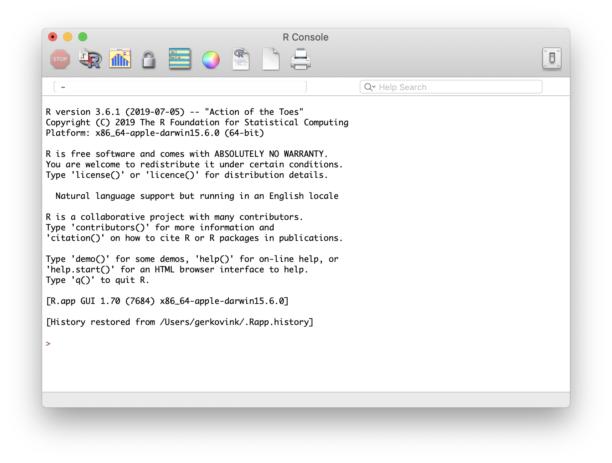

# Welcome back

## Programme {.smaller}

| **Day** |  **Time**     | **Purpose/Details** | **Material** | **Lecturer** | 
|-------------|---------------|---------------------|--------------|--------------|
| October 19 | 10:00 - 13:00  | Repetition and “Tidy data” | A | Joen Petur |
| October 19 | 14:00 - 17:00 | Statistical modeling | B | Anne |
| October 20 | 10:00 - 13:00  | Data Validation and Editing | C | Joen Petur |
| October 20 | 14:00 - 17:00 | Imputation | D | Anne |
| October 19 | 10:00 - 13:00  | Workshop - bring your own data | E | Anne & Joen Petur |
| October 19 | 14:00 - 17:00 | Summary | F  | Anne |

## Format
- Lectures followed by practicals
- Materials are on the homepage
  - "Impracticals" are the versions without solutions, "Practicals" the ones with
- Please do ask questions

# What is R?
## What is R?
<center>

</center>

## What is R? 
- R is a language and environment for statistical computing and for graphics

- GNU project (100% free software)

- Managed by the R Foundation for Statistical Computing, Vienna, Austria.

- Community-driven

- Based on the object-oriented language S (1975)

## What is Rstudio?

<center>

</center>

## What is RStudio?
- Aggregates all convenient information and procedures into one single place
- Allows you to work in projects
- Manages your code with highlighting
- Gives extra functionality (Shiny, knitr, markdown, LaTeX)
- Allows for integration with version control routines, such as Git.

## The R community
- Huge, active, welcoming online community
  - #rstats
  - rweekly
  - rbloggers
  - Stack Overflow
- Package development
  - About eight packages supplied with base R
  - More than 15.000 packages on CRAN

## CRAN: Comprehensive R Archive Network

<center>

</center>

## Task views

<center>

</center>

# Using R

## Help
- Everything that is published CRAN and is aimed at `R` users, must be accompanied by a help file. 
- If you know the name of the function that performs an operation, e.g. `anova()`, then you just type `?anova` or `help(anova)` in the console. 
- If you do not know the name of the function: type `??` followed by your search criterion. For example `??anova` returns a list of all help pages that contain the word 'anova'

## The basics

- Write commands directly in the console
- Or write code in the editor and submit with Ctrl + Enter
- Assign values to objects with `<-`

```{r, results = "hide"}
a <- c(1, 8, 42, pi, 2^3, 1)
b <- 0:5
c <- rep( c("Hi", "there"), 3)
D <- as.data.frame(cbind(a,b,c))
```

## Objects
Vectors and character vectors
```{r}
c(1,2,3,4,5)
1:5
as.character(1:5)
```

## Objects
Matrices 
```{r}
matrix(1:12, nrow = 3)
```
The elements of a vector or matrix must all have the same type


## Data frames
Data sets for R

```{r}
D <- as.data.frame(cbind(a,b,c))
D
```
Alternatively: `tibbles` or `data.tables` 

## Subsetting 

```{r}
D[1,3]
D[1,]
D[,2]
```


## Functions
```{r, warning=F, message=F}

addition <- function(x, y){
z <-   x + y
return(z)
}
addition(2,5)

in_vector_check <- function(x, y){
z <-   x %in% y
return(z)
}
in_vector_check(4, c(1,2,4,5,6))


```

## Pipes and the tidyverse

The tidyverse is a collection of packages that "share an underlying design philosophy, grammar, and data structures". They make for easier data handling and visualization. 

The pipe %>% allows for chained method calls that make code much more readable
```{r, results="hide", message = F}
library(dplyr)
starwars %>%
  filter( species == "Human" ) %>%
  group_by( homeworld ) %>% 
  summarise( n = n(), mean_height = mean(height),
             .groups = "drop")
```

## Plotting {.smaller}
Plots in base R are fast and easy:
```{r}
plot(starwars$height, starwars$mass)
hist(starwars$height)
```

## ggplot2
```{r, warning=F, message=F}
library(ggplot2)
starwars %>% ggplot( aes( x = height)) + geom_histogram()
```

## map
```{r, warning=F, message=F}
library(purrr)

map2(c(1,2,3,4), c(5,6,7,8), ~addition(.x, .y))

```
# Practical