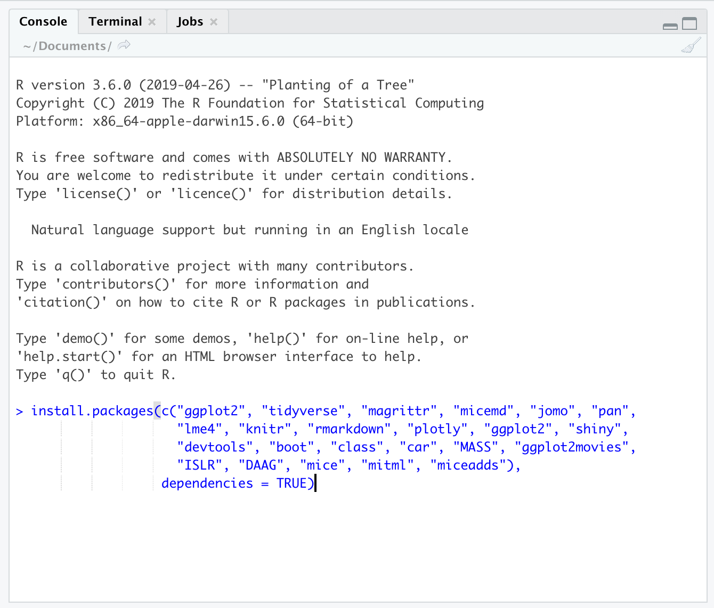

---
# Quick Overview

This dashboard covers the materials for the first follow-up course in R programming.  The course is held in Tbilisi, on October 19th to 21st 2021 . The course website of the introductory course can be found [here](https://annevinkel.github.io/RGeorgia/).

Instructors: 

 - Anne Vinkel Hansen (aih@dst.dk)
 - Joen Petur Jacobsen (jpj@dst.dk)


Part of the material for this course is adapted from [Gerko Vink](https://github.com/gerkovink/R), with gratitude


## Column 1

### Outline

This follow-up course deals with the following topics:

1.	The concept of tidy data
2.  Statistical modeling in `R`
3.  Data validation and editing
4.  Imputation

The first lesson Thursday will be a workshop where we ask you to bring your own data to work on. 


Previous experience with R is required.

## Column 2

### Course schedule 

| Time        | Topic                                           |
|:------------|:------------------------------------------------|
| *Tuesday*   |                                                 |
| 10.00-13.00 | Repetition and "Tidy data" (A)                  |
|             | *Break*                                         |    
| 14.00-17.00 | Statistical modeling (B)                        |
| *Wednesday* |                                                 |
| 10.00-13.00 | Data Validation and Editing (C)                 |
|             | *Break*                                         |             
| 14.00-17.00 | Imputation (D)                                  |
| *Thursday*  |                                                 |
| 10.00-13.00 | Workshop - bring your own data (E)              |
|             | *Break*                                         |
| 14.00-17.00 | Summary (F)                                     |


Each 3-hour block consists of approximately 1 hour of lectures, a coffee break and practicals plus a short follow-up on the practicals by the lecturers.  

The workshop on Thursday is a "free play" exercise, where you can work with your own data and try to use `R` to replicate previous analyses. We ask you to bring your own data and make a plan for what you want to do with the data - this does not necessarily have to be related to the subjects covered in this part of the course. We would prefer that you make sure you can read data into `R` before the workshop, so time can be used on analysis rather than reading in data. 

# How to prepare

## Column 1

### Preparing your machine for the course

The below steps guide you through installing both `R` as well as the necessary additions.

### **System requirements**

Bring a laptop computer to the course and make sure that you have full write access and administrator rights to the machine. We will explore programming and compiling in this course. This means that you need full access to your machine. Some corporate laptops come with limited access for their users, we therefore advice you to bring a personal laptop computer, if you have one. 

### **1. Install `R`**
`R` can be obtained [here](https://cran.r-project.org). We won't use `R` directly in the course, but rather call `R` through `RStudio`. Therefore it needs to be installed. 

### **2. Install `RStudio` Desktop**

Rstudio is an Integrated Development Environment (IDE). It can be obtained as stand-alone software [here](https://www.rstudio.com/products/rstudio/download/#download). The free and open source `RStudio Desktop` version is sufficient.

### **3. Start RStudio and install the following packages. **

Execute the following lines of code in the console window:

```{r eval=FALSE, echo = TRUE}
install.packages(c("tidyverse", "micemd", "jomo", "pan", 
                 "lme4", "knitr", "rmarkdown", "plotly",
                 "devtools", "boot", "class", "car", "MASS", 
                 "ISLR", "DAAG", "mice", "mitml", "miceadds",
                 "Ecdat", "Ecfun", "MEMSS", "VIM", "simputation",
                 "naniar","visdat", "UpSetR", "DAAG", "magrittr",
                 "haven", "Matrix", "lattice", "data.table", "grid",
                 "colorspace", "stringi", "stringdist", "editrules", 
                 "deducorrect", "rex"), 
                 dependencies = TRUE)
```


If you are not sure where to execute code, use the following figure to identify the console:

<center>
  
</center>

Just copy and paste the installation command and press the return key. When asked 

```{r eval = FALSE, echo = TRUE}
Do you want to install from sources the package which needs 
compilation? (Yes/no/cancel)
```

type `Yes` in the console and press the return key. 

## Column 2

### Preparing for Friday's workshop

The purpose of the workshop is to work on your own data, possibly attempting to replicate previous work done in other software. 

Please bring a dataset to work on, and make a plan for what analyses you want to do. 

In order to ensure that we don't spend the workshop reading data into `R` (unless that is what you want to work on!), please make sure that you can read in the data beforehand. 

Looking forward to seeing you in Tbilisi,

**Joen and Anne**

# Tuesday

## Column 1

### Tuesday's materials
We adapt the course as we go. To ensure that you work with the latest iteration of the course materials, we advice all course participants to access the materials online.

- Part A: Repetition

    - [Lecture A]
    <!-- (Contents/Material/Part A - Repetition and tidy data/Lecture_A.html){target="_blank"} -->
    - [Practical A]
    <!-- (Contents/Material/Part A - Repetition/Practical_A.html){target="_blank"} -->
    - [Practical A with solutions]
    <!-- (Contents/Material/Part A - Repetition and tidy data/Practical_A_walkthrough.html){target="_blank"} -->


- Part B: Statistical Modeling

    - [Lecture B]
    <!-- (Contents/Material/Part B - modeling/Lecture_B.html){target="_blank"} -->
    - [Practical B]
    <!-- (Contents/Material/Part B - modeling/Practical_B.html){target="_blank"} -->
    - [Practical B with solutions]
    <!-- (Contents/Material/Part B - modeling/Practical_B_walkthrough.html){target="_blank"} -->
    
All lectures are in `html` format. Practicals are exercies. The practicals with solutions are walkthrough files that guide you through the exercises.

## Column 2

### Useful references
- [Pipes in R](https://r4ds.had.co.nz/pipes.html)
- [Practical Regression with solutions and Anova using R](https://cran.r-project.org/doc/contrib/Faraway-PRA.pdf) by Julian Faraway  


# Wednesday

## Column 1

### Wednesday's materials
We adapt the course as we go. To ensure that you work with the latest iteration of the course materials, we advice all course participants to access the materials online.

- Part C: Data Validation and Editing
    - [Lecture C]
    <!-- (Contents/Material/Part C - Data validation/Lecture_C.html){target="_blank"} -->
    - [Practical C]
    <!-- (Contents/Material/Part C - Data validation/Practical_C.html){target="_blank"} -->
    - [Practical C with solutions]
    <!-- (Contents/Material/Part C - Data validation/Practical_C_walkthrough.html){target="_blank"} -->
    - Data for the practical: [bands.txt](Contents/Material/Part C - Data validation/data/bands.txt){target="_blank"}, 
      [unnamed.xls](Contents/Material/Part C - Data validation/data/unnamed.xls){target="_blank"},
      [people.txt](Contents/Material/Part C - Data validation/data/people.txt),
      [peoplerules.txt](Contents/Material/Part C - Data validation/data/peoplerules.txt),
      [dirty_iris.txt](Contents/Material/Part C - Data validation/data/dirty_iris.txt)


- Part D: Imputation

    - [Lecture D]
    <!-- (Contents/Material/Part D - Imputation/Lecture_D.html){target="_blank"} -->
    - [Practical D with solutions]
    <!-- (Contents/Material/Part D - Imputation/Practical_D_walkthrough.html){target="_blank"} -->
    - [Practical D]
    <!-- (Contents/Material/Part D - Imputation/Practical_D.html){target="_blank"} -->
    
All lectures are in `html` format. Practicals are exercies. The practicals with solutions are walkthrough files that guide you through the exercises.


## Column 2

### Useful references

- Data validation
  - [An introduction to data cleaning with R](https://cran.r-project.org/doc/contrib/de_Jonge+van_der_Loo-Introduction_to_data_cleaning_with_R.pdf)
  - [Mark van der Loo](http://www.markvanderloo.eu/) has given several talks and workshops on this, with slides available from his [GitHub](https://github.com/markvanderloo)
- Imputation
  - [Flexible Imputation of Missing Data](https://stefvanbuuren.name/fimd/): written by Stef van Buuren, uses the `mice` package. 
  - [Applied Missing Data Analysis](https://bookdown.org/mwheymans/bookmi/): book on missing data and imputation in R and SPSS.
  - [Visualization of Missingness Patterns](https://cran.r-project.org/web/packages/naniar/vignettes/naniar-visualisation.html): Tutorial for the naniar package that does nice visualizations of missingness patterns.
  - [Tutorial](https://www.analyticsvidhya.com/blog/2016/03/tutorial-powerful-packages-imputing-missing-values/): Tutorial describing the use of 5 different R-packages for missing data imputation.
  - [Tutorial](http://www.di.fc.ul.pt/~jpn/r/missing/index.html): Another tutorial on missing data in R.
  - [Tutorial](https://github.com/gerkovink/miceVignettes): a set of tutorials for the `mice` package.

# Thursday

## Column 1

### Thursday's materials
We adapt the course as we go. To ensure that you work with the latest iteration of the course materials, we advice all course participants to access the materials online.

All lectures are in `html` format. Practicals are walkthrough files that guide you through the exercises. `Impractical` files contain the exercises, without walkthrough, explanations and solutions.

## Column 2

### Useful references

# Further studies

## Column 1

### What to do after the course

The following references are currently available for free, either as pdfs or as extensive webpages (written with [RMarkdown](https://rmarkdown.rstudio.com/) and [bookdown](https://bookdown.org/)). They are all very useful and we highly recommend them. 

- [R for Data Science](https://r4ds.had.co.nz): written by Hadley Wickham and Garrett Grolemund this book relies almost exclusively on the [tidyverse](https://www.tidyverse.org/) approach to data analysis. Many highly effective tools will be right at your fingertips after reading this book and working through the many exercises.
- [Hands-On Programming with R](https://rstudio-education.github.io/hopr/): a great read by Garrett Grolemund emphasizing programming techniques with R. 
- [Advanced R](https://adv-r.hadley.nz/): You want to gain deeper knowledge of R and you want to learn from one of the most influential R contributors. This one is for you!
- [Introduction to Statistical Learning](http://faculty.marshall.usc.edu/gareth-james/ISL/): an introductory book on statistical learning, with applications in R. The R code is somewhat old-style and you might be able to find newer packages for the tasks, but ths is a solid read well worth the effort.
- [Data Analysis and Graphics Using R](http://www.pindex.com/uploads/post_docs/Maindonald%20Data%20Analysis%20and%20Graphics(PINDEX-DOC-6953).pdf): a detailed book that covers a lot about categorical data analysis and fitting `glm`s in `R`.
- [Happy Git and GitHub for the useR ](https://happygitwithr.com/index.html): a great introduction to version control using Git and GitHub together with RStudio. Written by Jenny Bryan in a very concise style. Highly recommended!

<!-- ## Column 2 -->

